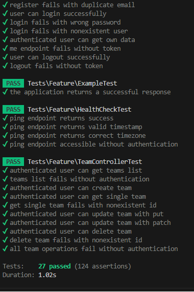
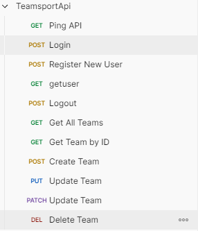

# Team Sport REST API megvalósítása Laravel környezetben

**base_url:** `http://127.0.0.1:8000/api` vagy `http://127.0.0.1/Team-Sport/public/api`

Az API-t olyan funkciókkal kell ellátni, amelyek lehetővé teszik annak nyilvános elérhetőségét. Ennek a backendnek a fő célja, hogy kiszolgálja a frontendet, amelyet a felhasználók csapatok létrehozására és kezelésére használnak.

**Funkciók:**
- Authentikáció (register, login, logout, token kezelés)
- Felhasználók regisztrálhatnak sportágukkal és tudásszintjükkel
- Csapatok létrehozása, listázása, módosítása, törlése (CRUD)
- Bearer Token alapú biztonságos API védelem Laravel Sanctum-mal
- Many-to-many kapcsolat users és teams között (team_members kapcsolótáblán keresztül)
- Magyar lokalizáció (időzóna, faker adatok)

### A teszteléshez
- 1 igazi user (mate@example.com / Mate123)
- 10 fake user
- 10 fake csapat
- Random tagságok csapatokban (captain, member, vice-captain szerepkörökkel)

Az adatbázis neve: `team_sport`

## Végpontok

A `Content-Type` és az `Accept` header kulcsok mindig `application/json` formátumúak legyenek.

Érvénytelen vagy hiányzó token esetén a backendnek `401 Unauthorized` választ kell visszaadnia:
```json
Response: 401 Unauthorized
{
  "message": "Unauthenticated."
}
```

### Nem védett végpontok
- **GET** `/ping` - teszteléshez
- **POST** `/register` - regisztrációhoz
- **POST** `/login` - belépéshez

### Védett végpontok (Bearer Token szükséges)

> Az innen következő végpontok autentikáltak, tehát a kérés headerében meg kell adni a tokent is:

> Authorization: Bearer 2|7Fbr79b5zn8RxMfOqfdzZ31SnGWvgDidjahbdRfL2a98cfd8

- **POST** `/logout` - kijelentkezés
- **GET** `/me` - saját profil lekérése
- **GET** `/teams` - csapatok listázása
- **POST** `/teams` - csapat létrehozása
- **GET** `/teams/{id}` - csapat részletei
- **PUT/PATCH** `/teams/{id}` - csapat frissítése
- **PATCH** `/teams/{id}/partial` - csapat részleges frissítése
- **DELETE** `/teams/{id}` - csapat törlése

### Hibák
- **401 Unauthorized** - A felhasználó nem jogosult a kérés végrehajtására. Ezt a hibát akkor kell visszaadni, ha érvénytelen a token.
- **404 Not Found** - A kért erőforrás nem található. Ezt a hibát akkor kell visszaadni, ha a kért csapat nem található.
- **422 Unprocessable Entity** - Validációs hibák esetén (pl. hiányzó vagy helytelen mezők).

---

## Összefoglalva

|HTTP metódus| Útvonal | Jogosultság | Státusz kódok | Rövid leírás |
|------------|---------|-------------|---------------|--------------|
|GET | /ping | Nyilvános | 200 OK | API teszteléshez |
|POST | /register | Nyilvános | 201 Created, 422 Unprocessable Entity | Új felhasználó regisztrációja |
|POST | /login | Nyilvános | 200 OK, 422 Unprocessable Entity | Bejelentkezés e-maillel és jelszóval |
|POST | /logout | Hitelesített | 200 OK, 401 Unauthorized | Kijelentkezés |
|GET | /me | Hitelesített | 200 OK, 401 Unauthorized | Saját profil lekérése |
|GET | /teams | Hitelesített | 200 OK, 401 Unauthorized | Csapatok listázása |
|GET | /teams/{id} | Hitelesített | 200 OK, 404 Not Found, 401 Unauthorized | Egy csapat részletei |
|POST | /teams | Hitelesített | 201 Created, 422 Unprocessable Entity, 401 Unauthorized | Csapat létrehozása |
|PUT/PATCH | /teams/{id} | Hitelesített | 200 OK, 404 Not Found, 422 Unprocessable Entity, 401 Unauthorized | Csapat frissítése |
|PATCH | /teams/{id}/partial | Hitelesített | 200 OK, 404 Not Found, 422 Unprocessable Entity, 401 Unauthorized | Csapat részleges frissítése |
|DELETE | /teams/{id} | Hitelesített | 200 OK, 404 Not Found, 401 Unauthorized | Csapat törlése |

## Adatbázis terv



```
┌──────────────────────┐     ┌─────────────────┐       ┌──────────────┐        ┌──────────┐
│personal_access_tokens│     │      users      │       │team_members  │        │  teams   │
├──────────────────────┤     ├─────────────────┤       ├──────────────┤        ├──────────┤
│ id (PK)              │  ┌─→│ id (PK)         │1─┐    │ id (PK)      │     ┌─→│ id (PK)  │
│ tokenable_id (FK)    │──┘  │ name            │  └───N│ user_id (FK) │     │  │ name     │
│ tokenable_type       │     │ email (unique)  │       │ team_id (FK) │N────┘  │ sport_   │
│ name                 │     │ password        │       │ role         │        │  type    │
│ token (unique)       │     │ sport_type      │       │ joined_at    │        │ max_mem- │
│ abilities            │     │ skill_level     │       │ created_at   │        │  bers    │
│ last_used_at         │     │ created_at      │       │ updated_at   │        │ created_ │
│ expires_at           │     │ updated_at      │       └──────────────┘        │  at      │
│ created_at           │     └─────────────────┘                               │ updated_ │
│ updated_at           │                                                        │  at      │
└──────────────────────┘                                                        └──────────┘
```

---

# I. Modul struktúra kialakítása

## 1. Telepítés (projekt létrehozása, .env konfiguráció, sanctum telepítése, tesztútvonal)

`célhely>composer create-project laravel/laravel --prefer-dist Team-Sport`

`célhely>cd Team-Sport`

*.env fájl módosítása*
```properties
DB_CONNECTION=mysql
DB_HOST=127.0.0.1
DB_PORT=3306
DB_DATABASE=team_sport
DB_USERNAME=root
DB_PASSWORD=
```

*config/app.php módosítása*
```php
'timezone' => 'Europe/Budapest',
'locale' => 'hu',
'faker_locale' => 'hu_HU',
```

`Team-Sport>composer require laravel/sanctum`

`Team-Sport>php artisan vendor:publish --provider="Laravel\Sanctum\SanctumServiceProvider"`

`Team-Sport>php artisan install:api`

*api.php:*
```php
use Illuminate\Support\Facades\Route;

Route::get('/ping', function () {
    return response()->json([
        'status' => 'success',
        'message' => 'API is running',
        'timestamp' => now()->toDateTimeString(),
        'timezone' => config('app.timezone'),
    ], 200);
});
```

### Teszt

**serve**

`Team-Sport>php artisan serve`

> POSTMAN teszt: GET http://127.0.0.1:8000/api/ping

*VAGY*

**XAMPP**

> POSTMAN teszt: GET http://127.0.0.1/Team-Sport/public/api/ping

---

## 2. Modellek és migráció (sémák)

Ami már megvan (database/migrations): 

*Ehhez nem is kell nyúlni*
```php
Schema::create('personal_access_tokens', function (Blueprint $table) {
    $table->id();
    $table->morphs('tokenable'); // user kapcsolat
    $table->string('name');
    $table->string('token', 64)->unique();
    $table->text('abilities')->nullable();
    $table->timestamp('last_used_at')->nullable();
    $table->timestamp('expires_at')->nullable();
    $table->timestamps();
});
```

*Ezt módosítani kell:*

```php
Schema::create('users', function (Blueprint $table) {
    $table->id();
    $table->string('name');
    $table->string('email')->unique();
    $table->timestamp('email_verified_at')->nullable();
    $table->string('password');
    //ezt bele kell írni
    $table->string('sport_type')->nullable();
    $table->string('skill_level')->nullable();
    //ezeket bele kell írni
    $table->rememberToken();
    $table->timestamps();
});
```

*app/Models/User.php (módosítani kell)*
```php
<?php

namespace App\Models;

use Illuminate\Database\Eloquent\Factories\HasFactory;
use Illuminate\Foundation\Auth\User as Authenticatable;
use Illuminate\Notifications\Notifiable;
use Illuminate\Database\Eloquent\Relations\HasMany;
use Illuminate\Database\Eloquent\Relations\BelongsToMany;
use Laravel\Sanctum\HasApiTokens;

class User extends Authenticatable
{
    use HasFactory, Notifiable, HasApiTokens;

    protected $fillable = [
        'name',
        'email',
        'password',
        'sport_type',
        'skill_level',
    ];

    //amikor a modellt JSON formátumban adod vissza ne jelenjenek meg a következő mezők:
    protected $hidden = [
        'password',
        'remember_token',
    ];

    protected function casts(): array
    {
        return [
            'email_verified_at' => 'datetime',
            'password' => 'hashed',
        ];
    }

    public function teamMembers(): HasMany
    {
        return $this->hasMany(TeamMember::class);
    }

    public function teams(): BelongsToMany
    {
        return $this->belongsToMany(Team::class, 'team_members')
            ->withPivot('joined_at', 'role')
            ->withTimestamps();
    }
}
```

`Team-Sport>php artisan make:model Team -m`

*database/migrations/?_create_teams_table.php (módosítani kell)*
```php
<?php

use Illuminate\Database\Migrations\Migration;
use Illuminate\Database\Schema\Blueprint;
use Illuminate\Support\Facades\Schema;

return new class extends Migration
{
    public function up(): void
    {
        Schema::create('teams', function (Blueprint $table) {
            $table->id();
            $table->string('name');
            $table->string('sport_type');
            $table->integer('max_members')->default(10);
            $table->timestamps();
        });
    }

    public function down(): void
    {
        Schema::dropIfExists('teams');
    }
};
```

*app/Models/Team.php (módosítani kell)*
```php
<?php

namespace App\Models;

use Illuminate\Database\Eloquent\Factories\HasFactory;
use Illuminate\Database\Eloquent\Model;
use Illuminate\Database\Eloquent\Relations\HasMany;
use Illuminate\Database\Eloquent\Relations\BelongsToMany;

class Team extends Model
{
    use HasFactory;
    
    protected $fillable = [
        'name',
        'sport_type',
        'max_members',
    ];

    public function teamMembers(): HasMany
    {
        return $this->hasMany(TeamMember::class);
    }

    public function users(): BelongsToMany
    {
        return $this->belongsToMany(User::class, 'team_members')
            ->withPivot('joined_at', 'role')
            ->withTimestamps();
    }
}
```

`Team-Sport>php artisan make:model TeamMember -m`

*database/migrations/?_create_team_members_table.php (módosítani kell)*
```php
<?php

use Illuminate\Database\Migrations\Migration;
use Illuminate\Database\Schema\Blueprint;
use Illuminate\Support\Facades\Schema;

return new class extends Migration
{
    public function up(): void
    {
        Schema::create('team_members', function (Blueprint $table) {
            $table->id();
            $table->foreignId('user_id')->constrained()->onDelete('cascade');
            //a user_id mező a users tábla id oszlopára fog hivatkozni
            $table->foreignId('team_id')->constrained()->onDelete('cascade');
            $table->timestamp('joined_at')->useCurrent();
            $table->string('role')->default('member'); // captain, member, vice-captain
            $table->timestamps();
        });
    }

    public function down(): void
    {
        Schema::dropIfExists('team_members');
    }
};
```

*app/Models/TeamMember.php (módosítani kell)*
```php
<?php

namespace App\Models;

use Illuminate\Database\Eloquent\Model;
use Illuminate\Database\Eloquent\Relations\BelongsTo;

class TeamMember extends Model
{
    protected $fillable = [
        'user_id',
        'team_id',
        'joined_at',
        'role',
    ];

    protected $casts = [
        'joined_at' => 'datetime',
    ];

    public function user(): BelongsTo
    {
        return $this->belongsTo(User::class);
    }

    public function team(): BelongsTo
    {
        return $this->belongsTo(Team::class);
    }
}
```

`Team-Sport>php artisan migrate`

---

## 3. Seeding (Factory és seederek)

*database/factories/UserFactory.php (módosítása)*
```php
<?php

namespace Database\Factories;

use Illuminate\Database\Eloquent\Factories\Factory;
use Illuminate\Support\Facades\Hash;
use App\Models\User;

class UserFactory extends Factory
{
    protected $model = User::class;

    public function definition()
    {
        $this->faker = \Faker\Factory::create('hu_HU'); // magyar nevekhez

        return [
            'name' => $this->faker->firstName . ' ' . $this->faker->lastName, // magyaros teljes név
            'email' => $this->faker->unique()->safeEmail(),
            'password' => Hash::make('password'), // minden user jelszava: password
            'sport_type' => $this->faker->randomElement(['football', 'basketball', 'volleyball', 'tennis']),
            'skill_level' => $this->faker->randomElement(['beginner', 'intermediate', 'advanced', 'expert']),
        ];
    }
}
```

`Team-Sport>php artisan make:factory TeamFactory`

*database/factories/TeamFactory.php (módosítása)*
```php
<?php

namespace Database\Factories;

use Illuminate\Database\Eloquent\Factories\Factory;
use App\Models\Team;

class TeamFactory extends Factory
{
    protected $model = Team::class;

    public function definition(): array
    {
        $this->faker = \Faker\Factory::create('hu_HU');
        
        $colors = ['Piros', 'Kék', 'Zöld', 'Sárga', 'Fekete', 'Fehér'];
        $animals = ['Tigrisek', 'Warriors', 'Dragons', 'Eagles', 'Lions', 'Sharks'];
        
        return [
            'name' => $this->faker->randomElement($colors) . ' ' . $this->faker->randomElement($animals),
            'sport_type' => $this->faker->randomElement(['football', 'basketball', 'volleyball', 'tennis']),
            'max_members' => $this->faker->numberBetween(8, 20),
        ];
    }
}
```

`Team-Sport>php artisan make:seeder TeamSeeder`

*database/seeders/TeamSeeder.php (módosítása)*
```php
<?php

namespace Database\Seeders;

use Illuminate\Database\Console\Seeds\WithoutModelEvents;
use Illuminate\Database\Seeder;
use App\Models\Team;
use App\Models\User;
use Illuminate\Support\Facades\Hash;

class TeamSeeder extends Seeder
{
    public function run(): void
    {
        // 1. Igazi user létrehozása: mate / Mate123
        $mate = User::create([
            'name' => 'Máté',
            'email' => 'mate@example.com',
            'password' => Hash::make('Mate123'),
            'sport_type' => 'football',
            'skill_level' => 'expert',
        ]);

        // 2. 10 fake user létrehozása Factory-val
        $fakeUsers = User::factory()->count(10)->create();

        // 3. Összes user (mate + 10 fake = 11 user)
        $allUsers = collect([$mate])->merge($fakeUsers);

        // 4. 10 fake team létrehozása Factory-val
        $teams = Team::factory()->count(10)->create();

        // 5. Random kapcsolatok létrehozása users és teams között
        $roles = ['captain', 'member', 'vice-captain'];
        
        $teams->each(function ($team) use ($allUsers, $roles) {
            // Minden csapathoz random 2-5 tag
            $membersCount = rand(2, 5);
            $selectedUsers = $allUsers->random(min($membersCount, $allUsers->count()));
            
            $selectedUsers->each(function ($user, $index) use ($team, $roles) {
                $team->users()->attach($user->id, [
                    'role' => $index === 0 ? 'captain' : fake()->randomElement($roles),
                    'joined_at' => now()->subDays(rand(1, 365)),
                ]);
            });
        });

        // 6. Mate-t berakjuk legalább 2 csapatba captain-ként
        $mateTeams = $teams->random(2);
        foreach ($mateTeams as $team) {
            if (!$team->users->contains($mate->id)) {
                $team->users()->attach($mate->id, [
                    'role' => 'captain',
                    'joined_at' => now()->subDays(rand(30, 90)),
                ]);
            }
        }
    }
}
```

*DatabaseSeeder.php (módosítása)*
```php
<?php

namespace Database\Seeders;

use Illuminate\Database\Console\Seeds\WithoutModelEvents;
use Illuminate\Database\Seeder;

class DatabaseSeeder extends Seeder
{
    use WithoutModelEvents;

    public function run(): void
    {
        $this->call([
            TeamSeeder::class,
        ]);
    }
}
```

`Team-Sport>php artisan db:seed`

---

# II. Modul Controller-ek és endpoint-ok

`Team-Sport>php artisan make:controller Api/AuthController`

*app\Http\Controllers\Api\AuthController.php szerkesztése*
```php
<?php

namespace App\Http\Controllers\Api;

use App\Http\Controllers\Controller;
use App\Models\User;
use Illuminate\Http\Request;
use Illuminate\Support\Facades\Hash;
use Illuminate\Validation\ValidationException;

class AuthController extends Controller
{
    /**
     * Register a new user
     */
    public function register(Request $request)
    {
        $request->validate([
            'name' => 'required|string|max:255',
            'email' => 'required|string|email|max:255|unique:users',
            'password' => 'required|string|min:8|confirmed',
            'sport_type' => 'nullable|string|max:255',
            'skill_level' => 'nullable|string|max:255',
        ]);

        $user = User::create([
            'name' => $request->name,
            'email' => $request->email,
            'password' => Hash::make($request->password),
            'sport_type' => $request->sport_type,
            'skill_level' => $request->skill_level,
        ]);

        $token = $user->createToken('auth_token')->plainTextToken;

        return response()->json([
            'message' => 'Registration successful',
            'user' => [
                'id' => $user->id,
                'name' => $user->name,
                'email' => $user->email,
                'sport_type' => $user->sport_type,
                'skill_level' => $user->skill_level,
            ],
            'access_token' => $token,
            'token_type' => 'Bearer',
        ], 201);
    }

    /**
     * Login user
     */
    public function login(Request $request)
    {
        $request->validate([
            'email' => 'required|email',
            'password' => 'required',
        ]);

        $user = User::where('email', $request->email)->first();

        if (!$user || !Hash::check($request->password, $user->password)) {
            throw ValidationException::withMessages([
                'email' => ['The provided credentials are incorrect.'],
            ]);
        }

        $token = $user->createToken('auth_token')->plainTextToken;

        return response()->json([
            'message' => 'Login successful',
            'user' => [
                'id' => $user->id,
                'name' => $user->name,
                'email' => $user->email,
                'sport_type' => $user->sport_type,
                'skill_level' => $user->skill_level,
            ],
            'access_token' => $token,
            'token_type' => 'Bearer',
        ]);
    }

    /**
     * Logout user (revoke token)
     */
    public function logout(Request $request)
    {
        $request->user()->currentAccessToken()->delete();

        return response()->json([
            'message' => 'Logout successful',
        ]);
    }

    /**
     * Get authenticated user
     */
    public function me(Request $request)
    {
        return response()->json([
            'user' => $request->user(),
        ]);
    }
}
```

`Team-Sport>php artisan make:controller Api/TeamController`

*app\Http\Controllers\Api\TeamController.php szerkesztése*
```php
<?php

namespace App\Http\Controllers\Api;

use App\Http\Controllers\Controller;
use App\Models\Team;
use Illuminate\Http\Request;

class TeamController extends Controller
{
    /**
     * Display a listing of all teams.
     */
    public function index()
    {
        $teams = Team::with('users')->paginate(15);

        return \App\Http\Resources\TeamResource::collection($teams);
    }

    /**
     * Store a newly created team.
     */
    public function store(Request $request)
    {
        $validated = $request->validate([
            'name' => 'required|string|max:255',
            'sport_type' => 'required|string|max:255',
            'max_members' => 'nullable|integer|min:1|max:100',
        ]);

        $team = Team::create([
            'name' => $validated['name'],
            'sport_type' => $validated['sport_type'],
            'max_members' => $validated['max_members'] ?? 10,
        ]);

        return response()->json([
            'message' => 'Team created successfully',
            'data' => $team->load('users'),
        ], 201);
    }

    /**
     * Display the specified team.
     */
    public function show(Team $team)
    {
        return new \App\Http\Resources\TeamResource($team->load('users'));
    }

    /**
     * Update the specified team (PUT or PATCH).
     */
    public function update(Request $request, Team $team)
    {
        // PATCH részleges frissítés támogatása
        $validated = $request->validate([
            'name' => 'sometimes|string|max:255',
            'sport_type' => 'sometimes|string|max:255',
            'max_members' => 'sometimes|integer|min:1|max:100',
        ]);

        $team->update($validated);

        return response()->json([
            'message' => 'Team updated successfully',
            'data' => $team->load('users'),
        ]);
    }

    /**
     * Partially update the specified team (PATCH - partial update).
     */
    public function partialUpdate(Request $request, Team $team)
    {
        $validated = $request->validate([
            'name' => 'sometimes|string|max:255',
            'sport_type' => 'sometimes|string|max:255',
            'max_members' => 'sometimes|integer|min:1|max:100',
        ]);

        $team->update($validated);

        return response()->json([
            'message' => 'Team partially updated successfully',
            'data' => $team->load('users'),
        ]);
    }

    /**
     * Remove the specified team.
     */
    public function destroy(Team $team)
    {
        $team->delete();

        return response()->json([
            'message' => 'Team deleted successfully',
        ]);
    }
}
```

`Team-Sport>php artisan make:resource TeamResource`

*app\Http\Resources\TeamResource.php szerkesztése*
```php
<?php

namespace App\Http\Resources;

use Illuminate\Http\Request;
use Illuminate\Http\Resources\Json\JsonResource;

class TeamResource extends JsonResource
{
    public function toArray(Request $request): array
    {
        return [
            'id' => $this->id,
            'name' => $this->name,
            'sport_type' => $this->sport_type,
            'max_members' => $this->max_members,
            'members_count' => $this->users->count(),
            'members' => $this->users->map(function ($user) {
                return [
                    'id' => $user->id,
                    'name' => $user->name,
                    'email' => $user->email,
                    'sport_type' => $user->sport_type,
                    'skill_level' => $user->skill_level,
                    'joined_at' => $user->pivot->joined_at,
                    'role' => $user->pivot->role,
                ];
            }),
            'created_at' => $this->created_at,
            'updated_at' => $this->updated_at,
        ];
    }
}
```

*routes\api.php frissítése:*
```php
<?php

use Illuminate\Support\Facades\Route;
use App\Http\Controllers\Api\AuthController;
use App\Http\Controllers\Api\TeamController;

// Public
Route::get('/ping', function () {
    return response()->json([
        'status' => 'success',
        'message' => 'API is running',
        'timestamp' => now()->toDateTimeString(),
        'timezone' => config('app.timezone'),
    ]);
});
Route::post('/register', [AuthController::class, 'register']);
Route::post('/login', [AuthController::class, 'login']);

// Authenticated
Route::middleware('auth:sanctum')->group(function () {
    Route::post('/logout', [AuthController::class, 'logout']);
    Route::get('/me', [AuthController::class, 'me']);
    
    Route::apiResource('teams', TeamController::class);
    Route::patch('/teams/{team}/partial', [TeamController::class, 'partialUpdate']);
});
```

---

# III. Modul Tesztelés

Feature teszt ideális az HTTP kérések szimulálására, mert több komponens (Controller, Middleware, Auth) együttműködését vizsgáljuk.

`Team-Sport>php artisan make:test AuthControllerTest`

*tests\Feature\AuthControllerTest.php*
```php
<?php

namespace Tests\Feature;

use Illuminate\Foundation\Testing\RefreshDatabase;
use Tests\TestCase;
use App\Models\User;
use Illuminate\Support\Facades\Hash;

class AuthControllerTest extends TestCase
{
    use RefreshDatabase;

    public function test_user_can_register_successfully(): void
    {
        $response = $this->postJson('/api/register', [
            'name' => 'Test User',
            'email' => 'test@example.com',
            'password' => 'password123',
            'password_confirmation' => 'password123',
            'sport_type' => 'football',
            'skill_level' => 'intermediate',
        ]);

        $response->assertStatus(201)
            ->assertJsonStructure([
                'message',
                'user' => ['id', 'name', 'email', 'sport_type', 'skill_level'],
                'access_token',
                'token_type',
            ]);

        $this->assertDatabaseHas('users', ['email' => 'test@example.com']);
    }

    public function test_register_fails_with_missing_fields(): void
    {
        $response = $this->postJson('/api/register', ['name' => 'Test User']);
        $response->assertStatus(422)->assertJsonValidationErrors(['email', 'password']);
    }

    public function test_register_fails_with_duplicate_email(): void
    {
        User::factory()->create(['email' => 'test@example.com']);
        $response = $this->postJson('/api/register', [
            'name' => 'Test User',
            'email' => 'test@example.com',
            'password' => 'password123',
            'password_confirmation' => 'password123',
        ]);
        $response->assertStatus(422)->assertJsonValidationErrors(['email']);
    }

    public function test_user_can_login_successfully(): void
    {
        User::factory()->create(['email' => 'test@example.com', 'password' => Hash::make('password123')]);
        $response = $this->postJson('/api/login', ['email' => 'test@example.com', 'password' => 'password123']);
        $response->assertStatus(200)->assertJsonStructure(['message', 'user', 'access_token', 'token_type']);
    }

    public function test_login_fails_with_wrong_password(): void
    {
        User::factory()->create(['email' => 'test@example.com', 'password' => Hash::make('password123')]);
        $response = $this->postJson('/api/login', ['email' => 'test@example.com', 'password' => 'wrongpassword']);
        $response->assertStatus(422);
    }

    public function test_authenticated_user_can_get_own_data(): void
    {
        $user = User::factory()->create();
        $token = $user->createToken('test_token')->plainTextToken;
        $response = $this->withHeaders(['Authorization' => 'Bearer ' . $token])->getJson('/api/me');
        $response->assertStatus(200)->assertJsonStructure(['user']);
    }

    public function test_user_can_logout_successfully(): void
    {
        $user = User::factory()->create();
        $token = $user->createToken('test_token')->plainTextToken;
        $response = $this->withHeaders(['Authorization' => 'Bearer ' . $token])->postJson('/api/logout');
        $response->assertStatus(200)->assertJson(['message' => 'Logout successful']);
    }
}
```

`Team-Sport>php artisan make:test TeamControllerTest`

*tests\Feature\TeamControllerTest.php*
```php
<?php

namespace Tests\Feature;

use Illuminate\Foundation\Testing\RefreshDatabase;
use Tests\TestCase;
use App\Models\User;
use App\Models\Team;

class TeamControllerTest extends TestCase
{
    use RefreshDatabase;

    private function authenticatedUser()
    {
        $user = User::factory()->create();
        $token = $user->createToken('test_token')->plainTextToken;
        return ['user' => $user, 'token' => $token];
    }

    public function test_authenticated_user_can_get_teams_list(): void
    {
        $auth = $this->authenticatedUser();
        Team::factory()->count(3)->create();
        $response = $this->withHeaders(['Authorization' => 'Bearer ' . $auth['token']])->getJson('/api/teams');
        $response->assertStatus(200);
    }

    public function test_teams_list_fails_without_authentication(): void
    {
        $response = $this->getJson('/api/teams');
        $response->assertStatus(401);
    }

    public function test_authenticated_user_can_create_team(): void
    {
        $auth = $this->authenticatedUser();
        $response = $this->withHeaders(['Authorization' => 'Bearer ' . $auth['token']])
            ->postJson('/api/teams', ['name' => 'Test Warriors', 'sport_type' => 'football', 'max_members' => 15]);
        $response->assertStatus(201)->assertJson(['message' => 'Team created successfully']);
        $this->assertDatabaseHas('teams', ['name' => 'Test Warriors']);
    }

    public function test_authenticated_user_can_delete_team(): void
    {
        $auth = $this->authenticatedUser();
        $team = Team::factory()->create();
        $response = $this->withHeaders(['Authorization' => 'Bearer ' . $auth['token']])->deleteJson("/api/teams/{$team->id}");
        $response->assertStatus(200)->assertJson(['message' => 'Team deleted successfully']);
        $this->assertDatabaseMissing('teams', ['id' => $team->id]);
    }
}
```

`Team-Sport>php artisan test`



---

## Dokumentálás
- word: végpontok
- md: projektleírás/fejlesztői dokumentáció
- scribe
- swagger
- POSTMAN

---

# Postman Tesztelés

## Postman Collection Import

A projektben található `TeamSport_API_READY.postman_collection.json` fájl importálható a Postmanbe:

1. Postman megnyitása
2. **Import** gomb → **File** → `TeamSport_API_READY.postman_collection.json` kiválasztása
3. Collection importálva → tesztelésre kész

## Tesztelési folyamat

### 1. API elérhetőség tesztelése

**GET** `/ping`

**Headers:**
```
Content-Type: application/json
Accept: application/json
```

**Válasz: 200 OK**
```json
{
    "status": "success",
    "message": "API is running",
    "timestamp": "2025-12-07 14:30:00",
    "timezone": "Europe/Budapest"
}
```

---

### 2. Regisztráció

**POST** `/register`

**Headers:**
```
Content-Type: application/json
Accept: application/json
```

**Body (JSON):**
```json
{
    "name": "Test User",
    "email": "testuser@example.com",
    "password": "Password123",
    "password_confirmation": "Password123",
    "sport_type": "football",
    "skill_level": "intermediate"
}
```

**Válasz: 201 Created**
```json
{
    "message": "Registration successful",
    "user": {
        "id": 12,
        "name": "Test User",
        "email": "testuser@example.com",
        "sport_type": "football",
        "skill_level": "intermediate"
    },
    "access_token": "2|AbCdEfGhIjKlMnOpQrStUvWxYz1234567890",
    "token_type": "Bearer"
}
```

**Token mentése:** Másold ki az `access_token` értékét!

---

### 3. Bejelentkezés

**POST** `/login`

**Headers:**
```
Content-Type: application/json
Accept: application/json
```

**Body (JSON):**
```json
{
    "email": "mate@example.com",
    "password": "Mate123"
}
```

**Válasz: 200 OK**
```json
{
    "message": "Login successful",
    "user": {
        "id": 1,
        "name": "Máté",
        "email": "mate@example.com",
        "sport_type": "football",
        "skill_level": "expert"
    },
    "access_token": "3|XyZ9876543210AbCdEfGhIjKlMnOpQrSt",
    "token_type": "Bearer"
}
```

---

### 4. Saját profil lekérése (védett)

**GET** `/me`

**Headers:**
```
Content-Type: application/json
Accept: application/json
Authorization: Bearer 3|XyZ9876543210AbCdEfGhIjKlMnOpQrSt
```

**Válasz: 200 OK**
```json
{
    "user": {
        "id": 1,
        "name": "Máté",
        "email": "mate@example.com",
        "sport_type": "football",
        "skill_level": "expert",
        "created_at": "2025-12-07T10:00:00.000000Z",
        "updated_at": "2025-12-07T10:00:00.000000Z"
    }
}
```

---

### 5. Csapatok listázása (védett)

**GET** `/teams`

**Headers:**
```
Content-Type: application/json
Accept: application/json
Authorization: Bearer 3|XyZ9876543210AbCdEfGhIjKlMnOpQrSt
```

**Válasz: 200 OK**
```json
{
    "data": [
        {
            "id": 1,
            "name": "Piros Warriors",
            "sport_type": "football",
            "max_members": 15,
            "members_count": 3,
            "members": [
                {
                    "id": 1,
                    "name": "Máté",
                    "email": "mate@example.com",
                    "sport_type": "football",
                    "skill_level": "expert",
                    "joined_at": "2025-10-01T08:00:00.000000Z",
                    "role": "captain"
                }
            ],
            "created_at": "2025-12-01T12:00:00.000000Z",
            "updated_at": "2025-12-01T12:00:00.000000Z"
        }
    ],
    "links": {...},
    "meta": {...}
}
```

---

### 6. Csapat létrehozása (védett)

**POST** `/teams`

**Headers:**
```
Content-Type: application/json
Accept: application/json
Authorization: Bearer 3|XyZ9876543210AbCdEfGhIjKlMnOpQrSt
```

**Body (JSON):**
```json
{
    "name": "Zöld Dragons",
    "sport_type": "basketball",
    "max_members": 12
}
```

**Válasz: 201 Created**
```json
{
    "message": "Team created successfully",
    "data": {
        "id": 11,
        "name": "Zöld Dragons",
        "sport_type": "basketball",
        "max_members": 12,
        "created_at": "2025-12-07T14:35:00.000000Z",
        "updated_at": "2025-12-07T14:35:00.000000Z"
    }
}
```

---

### 7. Csapat részleteinek lekérése (védett)

**GET** `/teams/1`

**Headers:**
```
Content-Type: application/json
Accept: application/json
Authorization: Bearer 3|XyZ9876543210AbCdEfGhIjKlMnOpQrSt
```

**Válasz: 200 OK**
```json
{
    "id": 1,
    "name": "Piros Warriors",
    "sport_type": "football",
    "max_members": 15,
    "members_count": 3,
    "members": [...],
    "created_at": "2025-12-01T12:00:00.000000Z",
    "updated_at": "2025-12-01T12:00:00.000000Z"
}
```

---

### 8. Csapat frissítése (védett)

**PUT/PATCH** `/teams/1`

**Headers:**
```
Content-Type: application/json
Accept: application/json
Authorization: Bearer 3|XyZ9876543210AbCdEfGhIjKlMnOpQrSt
```

**Body (JSON):**
```json
{
    "name": "Piros Warriors Updated",
    "max_members": 20
}
```

**Válasz: 200 OK**
```json
{
    "message": "Team updated successfully",
    "data": {
        "id": 1,
        "name": "Piros Warriors Updated",
        "sport_type": "football",
        "max_members": 20,
        "updated_at": "2025-12-07T14:40:00.000000Z"
    }
}
```

---

### 9. Csapat törlése (védett)

**DELETE** `/teams/1`

**Headers:**
```
Content-Type: application/json
Accept: application/json
Authorization: Bearer 3|XyZ9876543210AbCdEfGhIjKlMnOpQrSt
```

**Válasz: 200 OK**
```json
{
    "message": "Team deleted successfully"
}
```

---

### 10. Kijelentkezés (védett)

**POST** `/logout`

**Headers:**
```
Content-Type: application/json
Accept: application/json
Authorization: Bearer 3|XyZ9876543210AbCdEfGhIjKlMnOpQrSt
```

**Válasz: 200 OK**
```json
{
    "message": "Logout successful"
}
```

---

## Hibakezelés Postmanben

### 401 Unauthorized
```json
{
    "message": "Unauthenticated."
}
```
**Megoldás:** Ellenőrizd, hogy a Bearer token helyesen van-e megadva az Authorization headerben.

### 404 Not Found
```json
{
    "message": "No query results for model [App\\Models\\Team] 999"
}
```
**Megoldás:** A kért csapat ID nem létezik az adatbázisban.

### 422 Unprocessable Entity
```json
{
    "message": "The email has already been taken.",
    "errors": {
        "email": [
            "The email has already been taken."
        ]
    }
}
```
**Megoldás:** Validációs hiba - javítsd az input adatokat.
